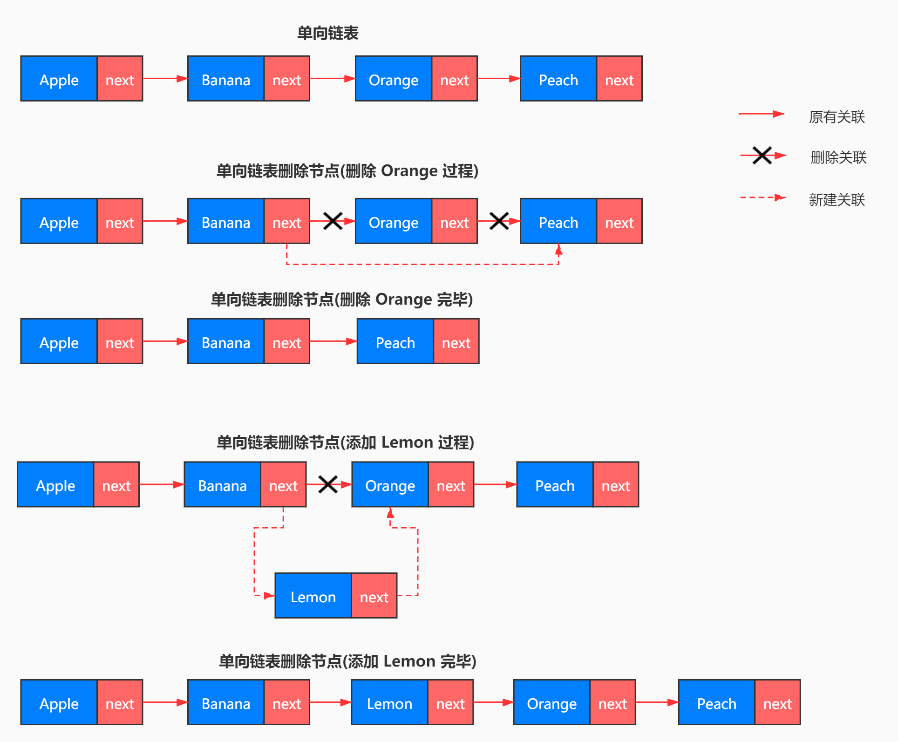
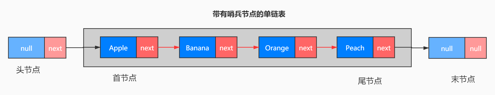

# 链表

# 1. 什么是链表？
链表是一种典型的动态存储结构，里边的数据由一系列的节点 node 组成，每一个节点通过指针互相索引和访问，而节点则由指针和节点所在的数据组成，查看下边的示例。

```c
struct node {
    init data;
    struct node* next;
}
```

```python
class Node:
    def __init__(self, value = None, next = None):
        self.value = value
        self.next = next
```

```java
public class LinkedListNode<T> {
  public T data;
  
  public LinkedListNode next;
}
```

```javascript
class Node {
  constructor(value) {
    this.value = value;
    this.next = null;
  }
}
```

通过不同语言的节点示例，可以看到每一个节点都有一个 next 属性，这个属性就是下一个节点的指针，就是指向下一个节点。

但是严格来看链表的定义里有 **互相索引和访问** 这个特点，互相索引所表达的意思应该是下一个节点可以访问上一个节点，下一节点可以访问上一个节点，示例里的节点只有一个 next 指针，只能指向下一个节点，不能指向上一个节点，这种链表叫做单链表，就是单向链接。



所以我们可以给每一个节点一个 prev 的指针，用来指向上一个节点，这样一个节点既可以指向上一个节点，也可以指向下一个节点，这样的链表叫做双链表。

# 2. 如何使用链表？

所以我们可以看到链表的特点是由一个一个的节点组成，而每一个节点仅仅与它的前一个节点和后一个节点有关系，而与其他位置的节点没有关系。那么换一句话说，如果说一个链表里的某一个节点指向下一个节点的指针指歪了，就是指错了，那么这个链表就歪到茄子地里去了。所以我们在修改节点的上一个和下一个指针指向的时候，一定要注意，不能指向错误，不然就是失之毫厘谬以千里。

说的专业一些，节点的前一个节点叫做该节点的前驱(predecessor)，后一个节点叫做该节点的后继(succeed)。

## 2.1 链表的首节点有没有前驱节点？或者说首节点能不能有前驱节点？为什么？

这个问题换成尾节点(最后一个节点)就是，尾节点有没有后继节点？或者说尾节点能不能有后继节点？为什么？

答案是可以有，也可以没有。



看这个图，灰色区域为链表的实际数据区域，而灰色区域外的两个节点是链表的两个哨兵，我们可以对这两个哨兵节点进行内部封装，使其对外部不可见。这样就可以保证链表的实际数据区域里每一个节点都有后继节点，如果是双链表的话，就是既有前驱节点，又有后继节点。但是这两个哨兵节点都不存储值，他们的值一直都是 null。

## 2.2 使用哨兵有什么好处？一定要使用哨兵吗？
使用了哨兵之后，对于外部而言，链表内部的每一个元素都有前驱节点和后继节点，所以在访问每一个节点的时候，不需要考虑是否边界问题，避免出错，可以简化算法。而且哨兵节点不参与具体的业务数据。

虽然说哨兵节点也占用了两个内存空间，但是这两个节点的存储成本，远远低于由此带来的便利性，所以可以忽略不计。

所以我们不一定要用哨兵节点，这是一个取舍问题，不是是非问题。

## 2.3 如何添加元素和删除元素？


我们可以看上边单链表这张图，链表里一共有 4 个元素，从前往后分别是 Apple -> Banana -> Orange -> Peach，所以 Apple 节点是首节点，Peach 是尾节点。此时我们的需求是删除 Orange 节点，预期是这样的 `Apple -> Banana -> Peach`。

由于链表是从前往后链接形成的，我们只能通过前一个节点的 next 指针，才能知道下一个节点的信息。换一句话说就是，我们不能通过第一个节点就直接知道第三个节点的信息，无论第三个节点的值是什么，或者是第三个节点是否存在。

因此，链表这样节点之间互相连接的特点，以致于我们不能直接像数组那样直接通过索引访问。如果我们要访问链表的第三个节点，必须先知道链表的第二个节点，而要知道第二个节点，就必须要通过首节点。

我们要删除 Orange 节点，这就有两个可能性，第一种是链表中确实有 Orange 节点，另一种可能性是没有 Orange 节点。然而无论链表中是否有 Orange 节点，我们都需要从首节点的 next 指针，不断的通过 next 找下一个节点，判断下一个节点的值是否为 Orange，如果是 Orange，那么就删除 Orange 节点。如果到尾节点都没有找到 Orange 节点，那么说明这个链表里没有 Orange 节点，也就不存在删除的问题了。

然而问题就在于，如果链表里有 Orange 节点，我们如何删除 Orange 节点？

操作很简单，我们只需要把 Banana 的 next 指向 Peach，同时把 Orange 的 next 指向修改为 null 即可。这样，Banana 的 next 就指向了 Peach，链表中就没有了 Orange 节点。

如果要添加新节点，比如原链表还是 `Apple -> Banana -> Orange -> Peach`，要把 Lemon 添加到 Banana 节点的后边，Orange 节点的前边，预期链表是这样的 `Apple -> Banana -> Lemon -> Orange -> Peach`

参考删除的操作，从首节点通过 next 不断向后找，找到 Banana 节点之后，把 Banana 的 next 指向 Lemon 节点，同时把 Lemon 的 next 指向 Orange 节点即可，这样就实现了预期，具体操作查看上边的示例图。

## 2.4 链表的存储

数组有一个很明显的特点，就是每次使用都要固定长度，并且内存连续，所以数组很明显的特点就是内存连续。

但是链表的内存是不连续的，因为前一个节点只需要记录下一个结点的内存地址，也就是指针指向下一个结点的内存地址就可以，至于说这个内存具体在哪里存储不重要，重要的是有一个指针指向下一个结点。

所以我们可以用一些零散的内存来把链表的节点都串联起来，这样会更高效的使用内存。

## 2.5 链表的特点

+ 单链表，每一个节点都有后继节点。双链表，每一个节点都有前驱和后继节点。
+ 查找节点和修改节点时，要从首节点开始遍历查找，直到找到目标元素。
+ 添加和删除元素，添加时将新元素的前一个元素的 next 指向新元素，新元素的 next 指向原来的下一个元素。删除时只需要将被删除元素的前一个元素的 next 指向被删除元素的下一个元素即可。

|数据结构|操作|最优时间复杂度|最差时间复杂度|平均时间复杂度|
|-------|-------|-------|-------|-------|
|单链表|查询|O(1)|O(n)|O(n/2)|
|单链表|修改|O(1)|O(n)|O(n/2)|
|单链表|增加|O(1)|O(1)|O(1)|
|单链表|删除|O(1)|O(n)|O(n/2)|
|双向链表|查询|O(1)|O(n)|O(n/2)|
|双向链表|修改|O(1)|O(n)|O(n/2)|
|双向链表|增加|O(1)|O(1)|O(1)|
|双向链表|删除|O(1)|O(1)|O(1)|

# 3. 不同链表的实现

## 3.1 单链表
+ [单链表 JavaScript](./SingleLinkedList.js)

## 3.2 双链表
+ [双链表 JavaScript](./DoubleLinkedList.js)

## 3.3 循环链表
+ [循环链表 JavaScript](./LoopLinkedList.js)

# 4. LRU(Least Recently Used) 最近最少使用缓存淘汰算法
+ 使用一个有序单链表，越靠近链表尾部的结点是越早之前访问的。当有一个新的数据被访问时，我们从链表头开始顺序遍历链表。
+ 如果此数据之前已经被缓存在链表中了，我们遍历得到这个数据对应的结点，并将其从原来的位置删除，然后再插入到链表的头部。
+ 如果此数据没有在缓存链表中，又可以分为两种情况：
    + 如果此时缓存未满，则将此结点直接插入到链表的头部；
    + 如果此时缓存已满，则链表尾结点删除，将新的数据结点插入链表的头部。

# 5. 扩展(Java 的 LinkedList)

[源码链接](http://developer.classpath.org/doc/java/util/LinkedList-source.html)

[本地源码](./LinkedList.java)

