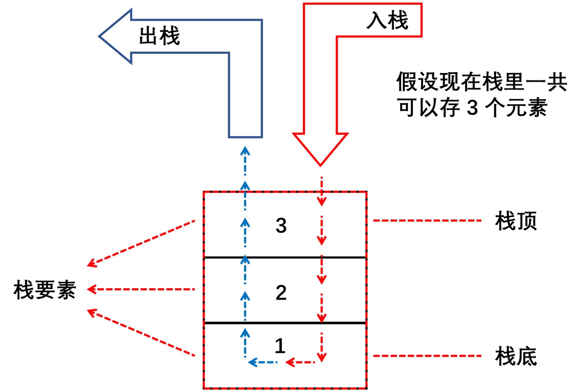

# 栈

# 1. 什么是栈？

栈也是存放数据对象的一种容器，其中的数据元素按线性的逻辑次序排列，栈只有一个口，这个口既是入口又是出口。



把元素添加到站内的操作叫做入栈，把元素移出栈的操作叫做出栈。

栈最大的特点就是先进后出，后进先出。以现实中的羽毛球筒为例子，羽毛球筒只有一个口，这个口既可以放入羽毛球，又可以取出羽毛球，但是放入第一个羽毛球，再放入第二个羽毛球，我们此时只能先取出第二次放的羽毛球，取出第二次放的羽毛球之后，才能取出第一次放的羽毛球。所以总结一下就是，先放入羽毛球筒的羽毛球后被拿出来，后放入羽毛球筒的羽毛球先被拿出来。

但是，由于我们只能操作最后一个入栈的元素，所以这个元素就是栈顶元素。对应的最先入栈的元素，就叫栈底元素。

如果往一个空栈里添加元素 A，那么元素 A 既是栈顶元素，又是栈底元素。然后再放入元素 B，那么元素 A 就是栈底元素，元素 B 就是栈顶元素。再放入元素 C，那么 C 就是栈顶元素，A 还是栈底元素。

如果此时我们取出栈顶元素 C，那么栈里就剩下 A 和 B 两个元素，B 就成为了栈顶元素，A 还是栈底元素。

注意：栈每次只能操作栈顶的元素，也就是说，如果想要删除元素，只能从栈顶开始删除，不能从栈底或者中间开始删除。

# 2. 实现一个栈

一般来说，我们都会基于数组来实现一个栈，这样比较方便快捷，但是我们会基于数组再封装一层，不直接使用数组作为栈。


+ 先进后出，后进先出
+ 只能操作栈顶元素

# 3. 栈的应用
## 3.1 数制间的转换

```javascript
function convertDeciToBinary(num) {
  const stack = new Stack(64);
  
  let x;
  while (num > 0) {
    x = num % 2;
    stack.push(x);
    num = Math.floor(x / 2);
  }
  
  let res = '';
  while (!stack.isEmpty()) {
    res += stack.pop();
  }
  return res;
}

console.log(convertDeciToBinary(52));
```

## 3.2 括号匹配

```javascript
function matchBracket(str) {
    const stack = new Stack(100);
    for (let i = 0; i < str.length; i++) {
      const alpha = str[i];
      switch (alpha) {
        case ')':
          if (stack.pop()=== '(') {
            break;
          } else {
            return false;
          }
        case ']':

          if (stack.pop() === '[') {
            break;
          } else {
            return false;
          }
        case '}':
          if (stack.pop() !== '{') {
            return false;
          }
          break;
        default:
          stack.push(alpha);
      }
    }
    return stack.isEmpty();
  }
```

## 3.3 判断是否为回文字符串

> 回文：一个单词、短语或数字，从前往后和从后往前都是一样的。比如 dad，1001 等。

把字符串按照从左往右的顺序压入栈，当字符串都入栈后，站内就保存了一个反转后的字符串，最后一个字符在栈顶，第一个字符在栈底。字符串完整压入栈内后，通过持续弹出栈中的每一个字母就可以得到一个新的字符串，该字符串刚好与原来的字符串顺序相反。

```javascript
function isPalindrome(word) {
  let stack = new Stac();

  for (let i = 0; i < word.length; i++) {
    stack.push(word[i]);
  }

  let rWord = '';
  while (stack.length() > 0) {
    rWord += stack.pop();
  }

  return word === rWord;
}

let word = 'markram';
console.log(isPalindrome(word));

word = '.markram.';
console.log(isPalindrome(word));
```

## 3.4 计算阶乘

```javascript
function factorial(n: number) {
  let stack = new Stack<number>();

  while (n > 1) {
    stack.push(n--);
  }
  let res = 1;
  while (stack.length() > 0) {
    res *= stack.pop();
  }

  return res;
}

let res = factorial(5);
console.log(res);
```
