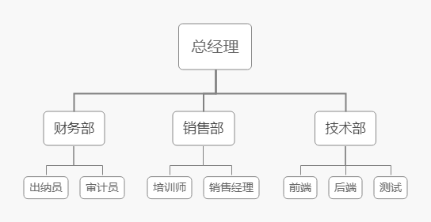
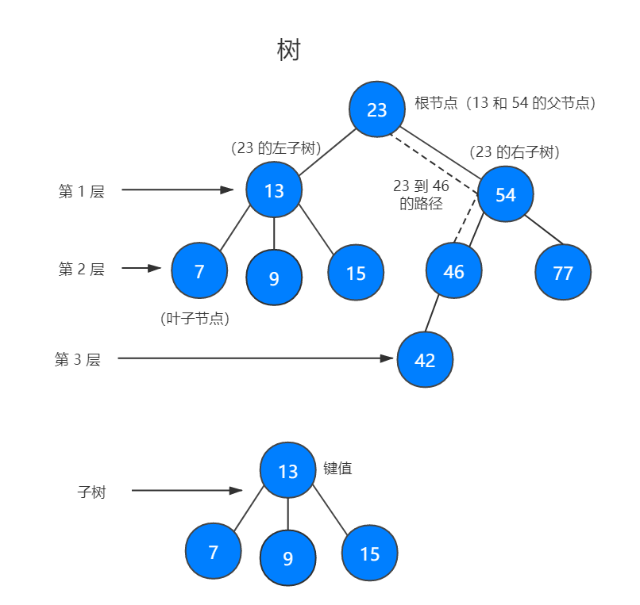
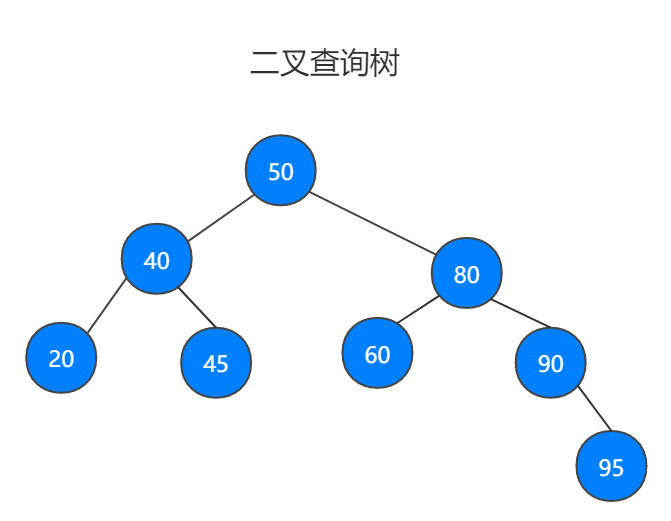
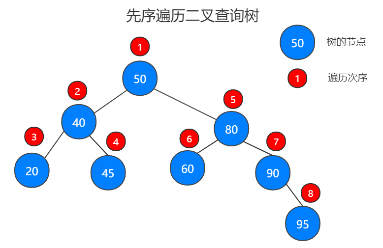
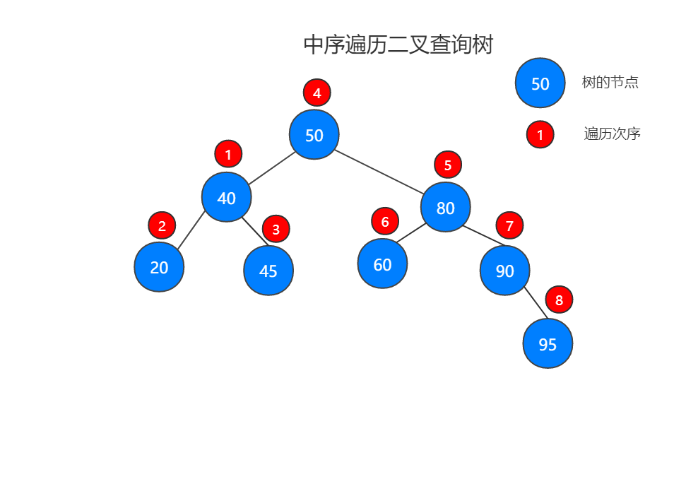
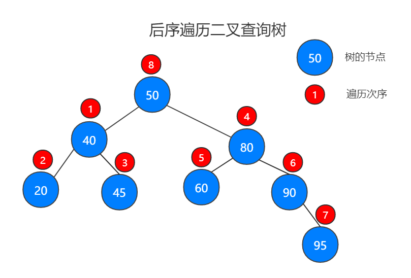
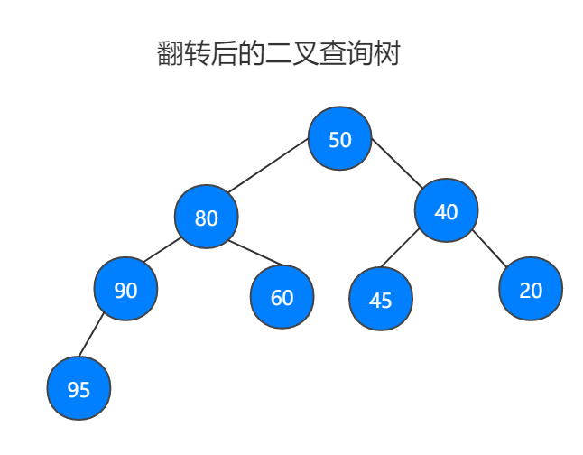

# 1. Tree

树是一种非线性的数据结构，以分层的方式存储数据。树被用来存储具有层级关系的数据，比如文件系统中的文件；树还被用来存储有序列表。

树由一组以 _边_ 连接的节点组成，以组织结构图为例。



组织结构图是用来描述一个组织的架构。每一个方框都是一个 _节点_ ，连接方框的线叫做 _边_。节点代表了该组织中的各个职位，边描述了各职位间的关系，方框之间没有连线，说明这两个方框没有关系。



二叉树进行查找效率非常高，而链表查找的效率非常低，为二叉树添加或删除元素效率也很高。

一棵树最上面的节点称为 _根节点_ ，如果一个节点下面连接多个节点，那么该节点称为 _父节点_ ，它下面的节点称为 _子节点_ 。一个节点可以有 0 个、1 个或多个子节点。没有任何子节点的节点称为 _叶子节点_ 。

二叉树是一种特殊的树，它的子节点个数不能超过两个。二叉树具有一些特殊的计算形势，使得对它们的操作非常高校。

沿着一组特定的边，可以从一个节点走到另一个与他不直接相连的节点。从一个节点到另一个节点的这一组边称为 _路径_ ，在图中用虚线表示。以某种特定顺序访问树种所有的节点称为 _树的遍历_ 。

树可以分为几个层次，根节点是第 0 层，他的子节点是第 1 层，子节点的子节点是第 2 层，以此类推。树中任何一层的节点可以都看作是子树的根，该子树包含根节点的子节点，子节点的子节点等。我们定义树的层数就是树的深度。

每个节点都有一个与之相关的值，该值被称为 _键_ 。

一个父节点的两个子节点分别称为 _左节点_ 和 _右节点_ 。

# 2. 实现二叉查找树

二叉查找树原图。



## 2.1 二叉树 BinaryTree

二叉树的每个节点的子节点不能超过两个，通常将子节点的个数限定为 2，这样可以写出高效的程序在树中插入、查找和删除数据。

## 2.2 实现二叉查找树

二叉查找树是一种特殊的二叉树，相对较小的值保存在左节点，较大的值保存在右节点中，就比如上面的二叉树图。

```javascript
export class Node {
  constructor(value, left, right) {
    this.value = value;
    this.left = left;
    this.right = right;
  }
}

class BinarySearchTree {
  constructor() {
    this.root = null;
  }

  // 插入一个值
  insert(value) {
    let newNode = new Node(value, null, null);

    if (!this.root) {
      this.root = newNode;
    } else {
      this.insertNode(this.root, newNode);
    }
  }

  private insertNode(root, newNode) {
    if (newNode.value < root.value) {
      if (!root.left) {
        root.left = newNode;
      } else {
        this.insertNode(root.left, newNode);
      }
    } else {
      if (!root.right) {
        root.right = newNode;
      } else {
        this.insertNode(root.right, newNode);
      }
    }
  }

  // 删除某值
  remove(value) {
    if (!this.root) {
      return 'There is no root node';
    }

    this.removeNode(this.root, value);
  }

  private removeNode(root, value) {
    if (value < root.value) {
      root.left = this.removeNode(root.left, value);
      return root;
    } else if (value > root.value) {
      root.right = this.removeNode(root.right, value);
      return root;
    } else {
      if (!root.left && !root.right) {
        root = null;
        return root;
      }

      if (root.left) {
        root = root.left;
        return root;
      } else if (root.right) {
        root = root.right;
        return root;
      }

      let minRight = this.findMinNode(root.right);
      root.value = minRight.value;
      root.right = this.removeNode(root.right, minRight.value);
      return root;
    }
  }

  private findMinNode(root) {
    if (!root.left) {
      return root;
    } else {
      return this.findMinNode(root.left);
    }
  }

  // 查询定值
  search(value) {
    if (!this.root) {
      return 'There is no root node';
    }
    return this.searchNode(this.root, value);
  }

  private searchNode(root, value) {
    if (!root) {
      return false;
    }
    if (value < root.value) {
      return this.searchNodeq(root.left, value);
    } else if (value > root.value) {
      return this.searchNode(root.right, value);
    }
    console.log('value: ', value);
    return root;
  }

  // 先序遍历
  preOrder(root) {
    if (!root) {
      return 'There is no root node';
    }
    console.log(root.value);
    this.preOrder(root.left);
    this.preOrder(root.right);
  }

  // 中序遍历
  inOrder(root) {
    if (!root) {
      return 'There is no root node';
    }
    this.preOrder(root.left);
    console.log(root.value);
    this.preOrder(root.right);
  }

  // 后序遍历
  postOrder(root) {
    if (!root) {
      return 'There is no root node';
    }
    this.preOrder(root.left);
    this.preOrder(root.right);
    console.log(root.value);
  }

  // 树的最小值
  getMin(){
    let root = this.root;
    if (!root) {
      return;
    }

    while (!(root.left === null)) {
      root = root.left;
    }

    return root.value;
  }

  // 树的最大值
  getMax() {
    let root = this.root;
    if (!root) {
      return;
    }

    while (!(root.right === null)) {
      root = root.right;
    }

    return root.value;
  }

}

export default BinarySearchTree;
```

## 2.3 遍历二叉查找树

遍历二叉查找树有三种方式，_中序_ 、 _先序_ 和 _后序_ 。

**先序遍历**：先序遍历先访问根节点，然后以同样方式访问左子树和右子树。先遍历根节点，然后遍历左子树，从上往下遍历左子树根节点，然后遍历叶子节点，左子树遍历完后，遍历右子树。

**中序遍历**：中序遍历按照节点上的键值，以升序访问 BST 上的所有节点。先遍历左子树，从上往下遍历左子树根节点，然后遍历叶子节点，左子树遍历完后，遍历根节点，最后遍历右子树。

**后序遍历**：后序遍历先访问子节点，从左子树到右子树，再到根节点。先遍历左子树，从上往下遍历左子树根节点，然后遍历叶子节点，左子树遍历完后，遍历右子树，最后遍历根节点。

二叉查找树原图，跟上边的二叉查找树一样。


### 2.3.1 先序遍历



先序遍历二叉查找树

```javascript
class BinarySearchTree {
  
  ...

  // 先序遍历
  preOrder(root) {
    if (!root) {
      return 'There is no root node';
    }
    console.log(root.value);
    this.preOrder(root.left);
    this.preOrder(root.right);
  }
}

let binarySearchTree = new BinarySearchTree();

const arr = [50, 40, 80, 20, 90, 95, 45, 60];

arr.forEach(item => binarySearchTree.insert(item));

console.log(binarySearchTree.root);

console.log('先序遍历');
binarySearchTree.preOrder(binarySearchTree.root);
// [50, 40, 20, 45, 80, 60, 90, 95]
```

### 2.3.2 中序遍历



中序遍历二叉查找树

```javascript
class BinarySearchTree {
  
  ...

  // 中序遍历
  inOrder(root) {
    if (!root) {
      return 'There is no root node';
    }
    this.preOrder(root.left);
    console.log(root.value);
    this.preOrder(root.right);
  }
}

let binarySearchTree = new BinarySearchTree();

const arr = [50, 40, 80, 20, 90, 95, 45, 60];

arr.forEach(item => binarySearchTree.insert(item));

console.log(binarySearchTree.root);

console.log('中序遍历');
binarySearchTree.inOrder(binarySearchTree.root);
// [40, 20, 45, 50, 80, 60, 90, 95]
```

### 2.3.3 后序遍历



后序遍历二叉查找树

```javascript
class BinarySearchTree {
  
  ...

  // 后序遍历
  postOrder(root) {
    if (!root) {
      return 'There is no root node';
    }
    this.preOrder(root.left);
    this.preOrder(root.right);
    console.log(root.value);
  }
}

let binarySearchTree = new BinarySearchTree();

const arr = [50, 40, 80, 20, 90, 95, 45, 60];

arr.forEach(item => binarySearchTree.insert(item));

console.log(binarySearchTree.root);

console.log('后序遍历');
binarySearchTree.postOrder(binarySearchTree.root);
// [40, 20, 45, 80, 60, 90, 95, 50]
```

## 2.4 查找最大最小值定值

```javascript
class BinarySearchTree {
  
  ...

  // 树的最小值
  getMin() {
    let root = this.root;

    if (!root) {
      return;
    }

    while (!(root.left === null)) {
      root = root.left;
    }

    return root.value;
  }
  
    // 树的最大值
  getMax() {
    let root = this.root;

    if (!root) {
      return;
    }

    while (!(root.right === null)) {
      root = root.right;
    }

    return root.value;
  }
}

let binarySearchTree = new BinarySearchTree();

const arr = [50, 40, 80, 20, 90, 95, 45, 60];

arr.forEach(item => binarySearchTree.insert(item));

console.log(binarySearchTree.root);

console.log('min: ', binarySearchTree.getMin());
console.log('max: ', binarySearchTree.getMax());
// [40, 20, 45, 80, 60, 90, 95, 50]
```

## 2.5 翻转二叉查找树



```javascript
class BinarySearchTree {
  
  ...

  invertTree(node = this.root) {
    if (!node) {
       return false;
    }
    this.invertTree(node.left);
    this.invertTree(node.right);
    this.exchangeNode(node);
  }
  
  private exchangeNode(node) {
    let tempNode = node.left;
    node.left = node.right;
    node.right = tempNode;
  }
}

let binarySearchTree = new BinarySearchTree();

const arr = [50, 40, 80, 20, 90, 95, 45, 60];

arr.forEach(item => binarySearchTree.insert(item));

binarySearchTree.invertTree(binarySearchTree.root);

console.log(binarySearchTree.root);
```
