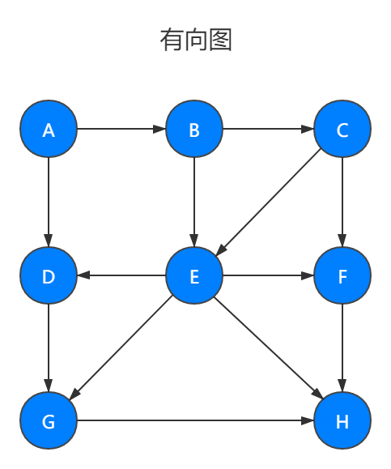
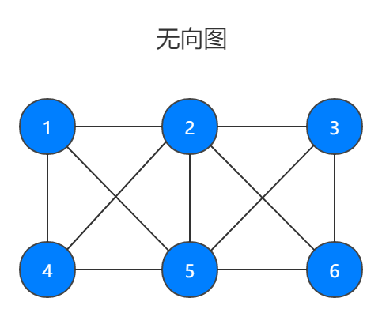

# 1. Graph

图是由 _边_ 的集合及 _顶点_ 的集合组成。地图就是一种图，每一个城镇可以看做一个顶点，链接城镇的道路就是边。

顶点也有权重，称为 _成本_ 。如果一个图的订单对是有序的，则可以称为 _有向图_ 。

在对有向图中的顶点对排序后，便可以在两个顶点之间绘制一个箭头。

有向图表明了顶点的流动。计算机程序中的流程图就是有向图。

**有向图 Digraph**

**无向图 UndirectedGraph**

图中的一系列顶点构成 路径 ，路径中所有的顶点都由边连接。路径的长度用路径中第一个顶点到最后一个顶点之间的边的数量表示。由指向自身的顶点组成的路径称为 _环_ ，环的长度为 0 。

_圈_ 是至少有一条边的路径，且路径的第一个顶点和最后一个顶点相同。无论是有向图还是无向图，只要是没有重复的边或重复顶点的圈，就是一个 _简单圈_ 。除了第一个和最后一个顶点以外，路径的其他顶点有重复的圈称为 _平凡圈_ 。

如果两个顶点之间有路径，那么这两个顶点就是 _强_ 连通的，反之亦然。如果有向图的所有的顶点都是强连通的，那么这个有向图也是强连通的。